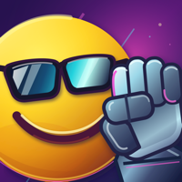
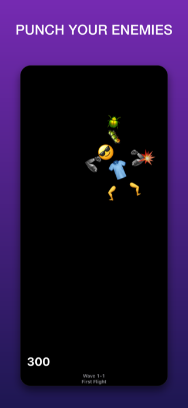
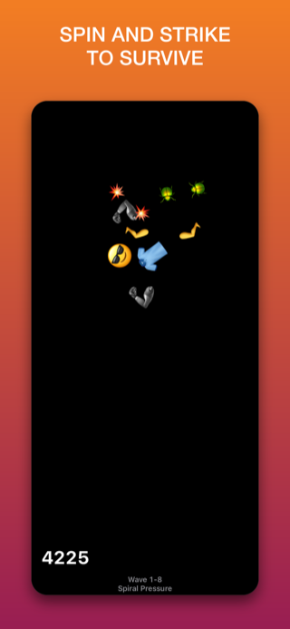
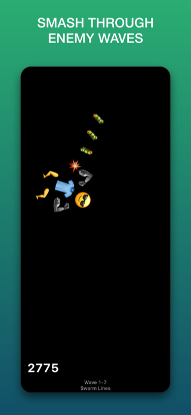
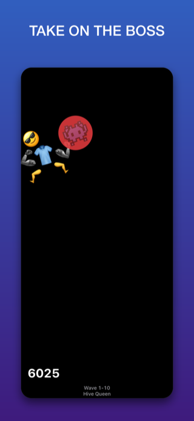
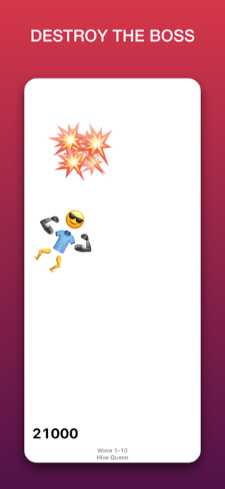
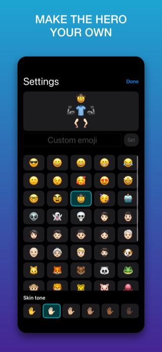
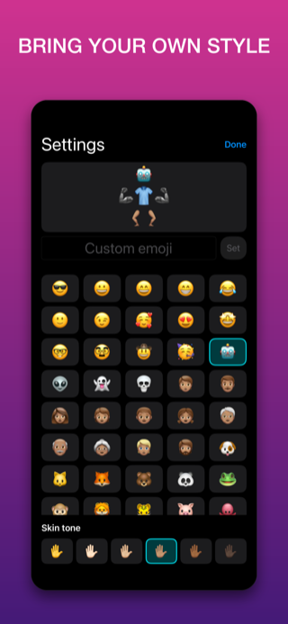
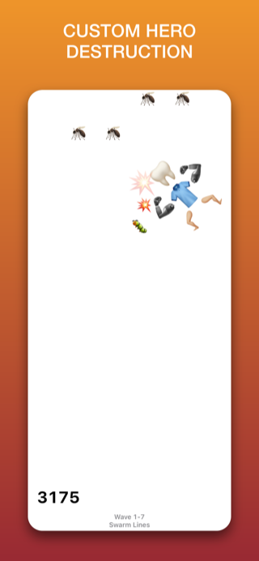
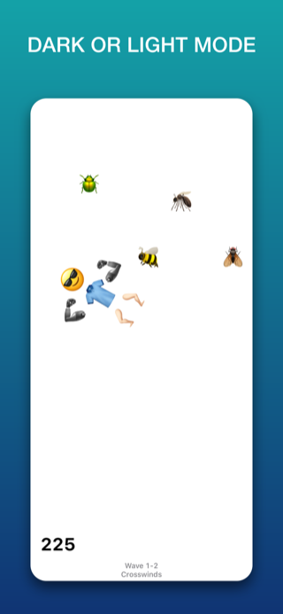

## A Playful, Physics-Driven Emoji Brawler

> Tap to launch your character or drag and fling its head, then let its swinging ragdoll arms collide with incoming enemies, earn points, advance through escalating waves, and take on oversized bosses. It's EmojiPuncher, built entirely with emoji.

EmojiPuncher is the first game out of EmojiGames, PatridgeDev's collection of small, emoji-powered games.

## Gameplay

Launch your character's head with a tap or a drag-and-fling, and its ragdoll arms swing along behind it. Use that unpredictable, physics-driven momentum to land arm swings on incoming enemies, rack up points, and survive wave after escalating wave.

As the swarm grows, spin your fighter through clusters of enemies to clear them out faster than you can pick them off one at a time.

## Waves and Bosses

Each wave ramps up the challenge, throwing more enemies and tougher patterns your way. Survive long enough and you'll come face-to-face with oversized bosses, like the Hive Queen, who take a lot more punishment (and a lot more spinning) to put down.

## Make It Your Fighter

Customize your character's face and skin tone before you jump in, then chase a higher score through the campaign with a fighter that actually looks like yours.

## Availability

EmojiPuncher is currently in beta testing through TestFlight, with a focus on refining controls, collision behavior, game balance, sound, performance, and compatibility across different iPhone sizes. Feedback from testers is greatly appreciated and goes directly into improving the game before a wider release.
